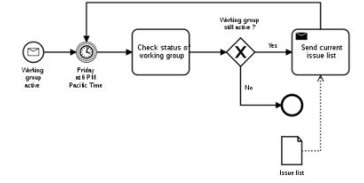

## Import-Export : Semaine 2

### Lundi 9 mai

- Commencé à faire des recherches sur ce qui interesserait l'utilisateurs en terme d'import. 
- Quels types de fichiers on aimerait pouvoir convertir? 
- Quels types de fichiers sont les plus populaires? 
- Quelles sont les parties qu'on peut convertir et celles qu'on doit laisser et expliquer pourquoi on a pas pu les convertir. 

Pendant mes recherches j'ai trouvé : 

- https://www.computerhope.com/issues/ch001789.htm
- https://blog.filestack.com/thoughts-and-knowledge/document-file-extensions-list/
- https://www.converter365.com/blog/most-common-file-extensions-for-windows/

Ici , j'ai noté ceux que je pensais qui seraient les plus intéressants pour l'utilisateur. 
Après avoir discuté de quels et quels types seraient convertible où pas (On avait déjà défini YAML comme un type convertible), on est venu à la conclusion qu'il fallait pour qu'un fichier soit convertible , il fallait que la partie du fichier soit étiquettée c'est-à-dire que ça donnée a un 'label' , une étiquette. Par exemple : 

    Bibliothèque : BANq  
	Auteur : Jean-Jacques Rousseau   
	Titre : Rêveries du promeneur solitaire   
	Éditions : Folio Classiques      
	Dates de parution : 2006   

On a alors conclu qu'on aller se concentrer sur 3 types de fichiers : YAML, XML , et CSV. Étant donné que j'avais encore des problèmes de clonage avec mon ordinateur, on a setup gentleman avec un ordinateur du DIRO. 

On a à partir de là installé les dépendances nécessaires au fonctionnement de gentlemant npm et node. Et j'ai vu pour la première fois comment on pouvait le run.

Et de là , Louis-Édouard m'a expliqué l'architecture général du code, m'a montré les fichiers des modèles trafic lights et to do list . Et en général , comment le code fonctionnait , ce qu'il appelait à partir d'index, comment l'exécuter et le build. 

### Jeudi 12 mai

On a commencé à penser **comment** on pourrait implémenter l'import. Et on a établi à ce point qu'on allait commencer par établir l'import puis après dans le projet on implémenterait l'export. Ce jour-là , nous avons commencé l'analyse des besoins que je ferai et qui continuera jusqu'à la semaine prochaine. 

J'ai fait la recherche à savoir comment faire une analyse des besoins : 

On m'avais présenté ce site si bien fait : https://ceduni.github.io/udem-ift2255/index.html . 

Mais finalement, j'ai suivi le squelette de ce site : https://www.simplilearn.com/what-is-requirement-analysis-article . 

Avec les étapes suivantes : 

### PAGE EN QUESTION :

**Step 1: Identify Key Stakeholders and End-Users**

The first step of the requirements analysis process is to identify key stakeholders who are the main sponsors of the project. They will have the final say on what should be included in the scope of the project. 

Next, identify the end-users of the product. Since the product is intended to satisfy their needs, their inputs are equally important. 
**Step 2: Capture Requirements**

Ask each of the stakeholders and end-users their requirements for the new product. Here are some requirements analysis techniques that you can use to capture requirements:
- 1. Hold One-on-One Interviews

Interview each stakeholder and end-user individually. This technique will help you gather specific requirements.
- 2. Use Focus Groups

Conduct group interviews or group workshops to understand the flow of information between different stakeholders and end-users. This technique will ensure that there will be no conflict of interest later on during the project.
- 3. Utilize Use Cases

Use cases provide a walkthrough of the entire product through the eyes of the end-user. This technique will help visualize how the product will actually work.
- 4. Build Prototypes

A prototype provides users a sample look and feel of the final product. This technique will help address feasibility issues and identify problems ahead of time.

Business & Leadership Courses
Business Analysis Certification 	CCBA 	Business Analysis Course
Online MBA Course 	CBAP 	Design Thinking Course
PGP Digital Transformation 	Post Graduate Diploma in Management 	Digital Transformation
Step 3: Categorize Requirements

Since requirements can be of various types, they should be grouped to avoid confusion. Requirements are usually divided into four categories:

> Functional Requirements - Functions the product is required to perform.
> Technical Requirements - Technical issues to be considered for the successful implementation of the product.
> Transitional Requirements - Steps required to implement a new product smoothly.
> Operational Requirements - Operations to be carried out in the backend for proper functioning of the product.

Business & Leadership Courses
Business Analysis Certification 	CCBA 	Business Analysis Course
Online MBA Course 	CBAP 	Design Thinking Course
PGP Digital Transformation 	Post Graduate Diploma in Management 	Digital Transformation
**Step 4: Interpret and Record Requirements**

1. Once the requirements are categorized, determine which requirements are actually achievable and document each one of them. Here are some techniques to analyze and interpret requirements:
Define Requirements Precisely

2. Ensure that the requirements are clearly worded, sufficiently detailed, and related to business needs.
Prioritize Requirements

3. Prioritize requirements and list them out based on which ones are the “most critical” and which ones are just “nice-to-have”.
Carry Out an Impact Analysis

4. Carry out an impact analysis to make sure that you fully understand the consequences of the requirements.
Resolve Conflicts

5. Arrange a meeting with key stakeholders and resolve conflicting requirements. You can also perform a scenario analysis to explore how the requirements would work for different possible scenarios.
Analyze Feasibility

6. Perform a detailed analysis of the product based on the requirements gathered to determine its reliability and to identify any major problems.

7. Once all the requirements are analyzed, create a detailed written document and circulate it among the key stakeholders, end-users and development teams.

**Step 5: Sign off**

Once a final decision is made on the requirements, ensure that you get a signed agreement from the key stakeholders. This is done to ensure that there are no changes or uncontrolled growth in the scope of the project.

**Now, we will learn the requirement analysis techniques.**

1. Business Process Model and Notation (BPMN)

Business Process Model and Notation is used to create graphs that simplify the understanding of the business process. It is a popular technique used by business analysts to coordinate the sequence of messages between different participants in a related set of activities.

    

2. Flowcharts

Flowcharts depict sequential flow and control logic of a related set of activities. They are useful for both technical and non-technical members. 

flowchart

Fig: Flowchart example

3. Gantt Charts

Gantt Charts provide a visual representation of tasks along with their scheduled timelines. They help business analysts visualize the start and end dates of all the tasks in a project.

gantt

Fig: Gantt Charts example

4. Gap Analysis

Gap analysis evaluates the gaps in a product’s performance to determine whether the requirements are met or not. They help business analysts determine the present state and target state of a product.

gap

Fig: Gap analysis example
