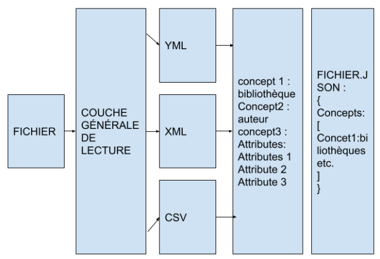

## Import-Export : Semaine 3

### Lundi 17 mai

encore continué sur les specifications analyse des besoins 

- Finir le cas d'utilisation de l'import 

- Faire le prototype 

Prototype doit correspondre au cas d'utilisation et sera utilisé lors des interviews et des focus groups. 

lien vers google drive : https://docs.google.com/document/d/1ErILHYyODbcBNphZWjyhplW19ZvdGiCBD8HEHON7fh4/edit?usp=sharing

Architecture du module d'import 

Il reste à : 

- prioritiser les besoins (besoin fonctionnels vs non fonctionnels)
- les risques
- la faisabilité 

J'ai avancé le cas de l'utilisation de l'import 

### Jeudi 19 mai

Pendant ce temps, le UC de l'import avaient assez avancés pour que nous puissions nous fixer un échéancier.

D'ici la fin mai , nous arriverons à convertir en un json : 

- bibliotheque.xml
- courses.yml
- soir_sample.csv

On a vu l'architecture du projet qui est composé de 3 partie : 

1. la lecture qui est composé de deux couches : 
 a. la couche générale 
 b. la couche spécifique au type de fichier (XML,YML,CSV) c'est à dire utiliser le parser spécifique ou parser spécifiquement étant donné le format donné
2. La 'sérialisation' c'est-à-dire , avoir les données sous la forme : 
- champ1 : valeur1
- champ2 : valeur2
- champ3 : valeur3
- champ4 : valeur4
3. prendre les méta-données et les mettre sous forme de json. 

Voici le schéma de l'architecture : 

  </img>  

## Analyse des besoins 

### End-User : Import

 Mostly everyone. It includes programmers and people who are comfortable with technology but , normally , anyone who knows how to use a computer and an interface should be able to drop a file or look for the file via the interface. A user should be able to deposit his file without any knowledge of what a Json,XML,Yaml is, or without having to convert his file or having to reformat his file. The typical End-User will be someone who has little to no knowledge of how an interface , or a code, or the inner functioning of a computer works , he just knows how to follow steps indicated by an interface which is the case of most computer users . Of course, only certain files can have parts that are convertible to a ‘gentleman look’.But the system should at least be able to tell which parts, if any , are ‘convertible’ and which ones are not and why.  

 