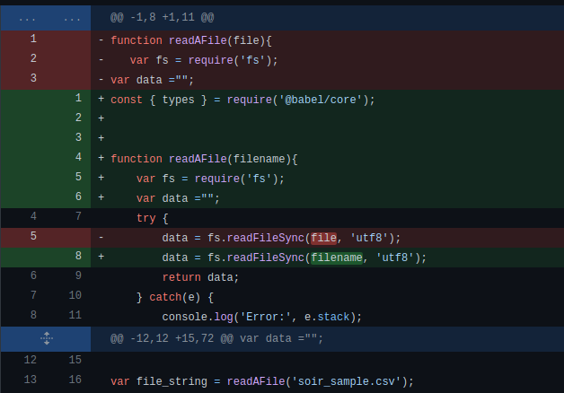

## Semaine 6 : Import  

### Lundi : Début du codage 

<ul>
	<li>Maintenant qu'on a bien compris les bases de gentleman (ce qui inclut les primitives , et les formats acceptés et des fichiers qui sont pris en entrés par l'éditeur pour créer et manipuler les modèles.</li>
  <li>J'ai commencé à coder la conversion de soir_sample dynamiquement,soit : 
	<ul>
		<li>readAFile qui est une fonction qui prend un nom de fichier en string et retourne</li>
		<li>J'ai d'abord essayé avec readFile() : function readAFile(file) qui n'as pas marché plus particulièrement j'avais de la difficulté avec les exemples que j'ai trouvé en ligne à savoir : 
			<ul>
				<li>https://nodejs.dev/learn/reading-files-with-nodejs</li>
				<li><a href="https://nodejs.org/en/knowledge/file-system/how-to-read-files-in-nodejs/">https://nodejs.org/en/knowledge/file-system/how-to-read-files-in-nodejs/</a></li>
				<li><a href="https://www.geeksforgeeks.org/node-js-fs-readfile-method/">https://www.geeksforgeeks.org/node-js-fs-readfile-method/</a></li>
				<li><a href="https://stackabuse.com/read-files-with-node-js/">https://stackabuse.com/read-files-with-node-js/</a></li>
				<li>Ainsi j'avais en guise de lecture ceci :  
					</img>
				</li>
			</ul>
		<li>J'ai fait plusieurs itération de cette fonction plus spécifiquement l'erreur "no such file or directory" quand le fichier en question était dans le même répertoire que le fichier de code ou que le code n'arrivait pas à trouver mon fichier de fonction  
		<li>J'ai également eu la fonction : parseCSV() (essaie de parser le fichier csv mais est enlevé), file2DDataFrame( qui seperator) qui convertit et typeInference  
		</li>
		<li>Inspiré de : <a href="https://www.geeksforgeeks.org/node-js-fs-readfilesync-method/">https://www.geeksforgeeks.org/node-js-fs-readfilesync-method/</li>
	</ul>
  </li>
  
</ul>